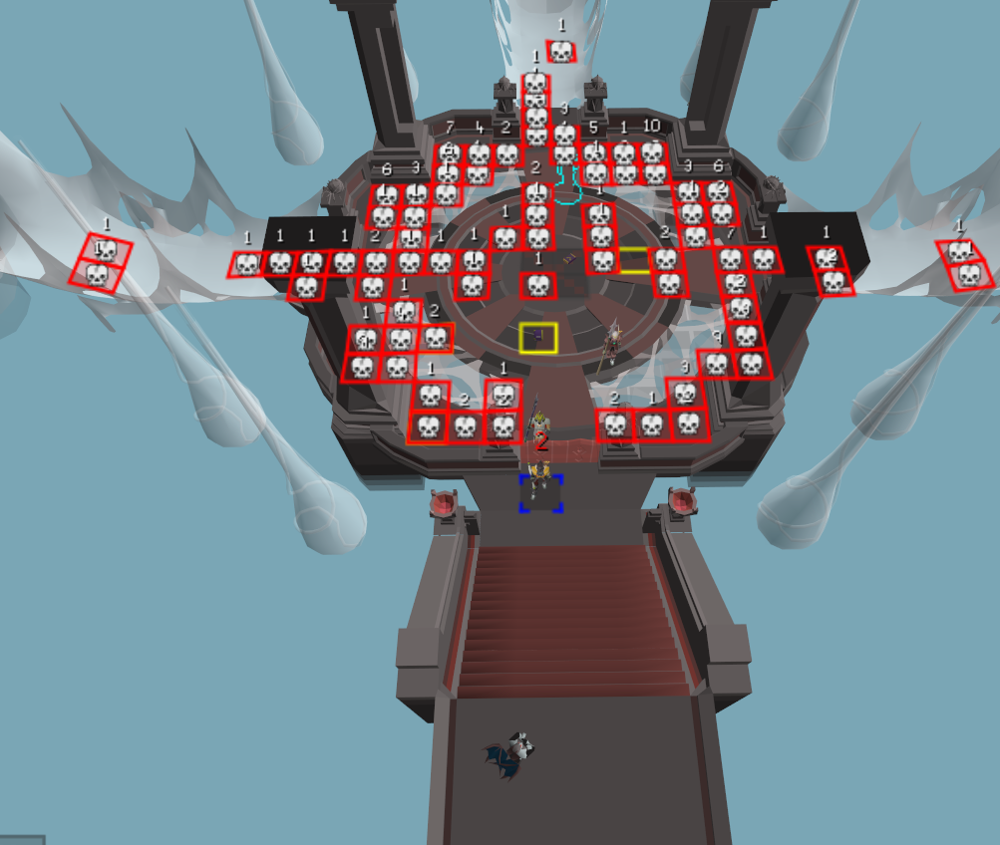
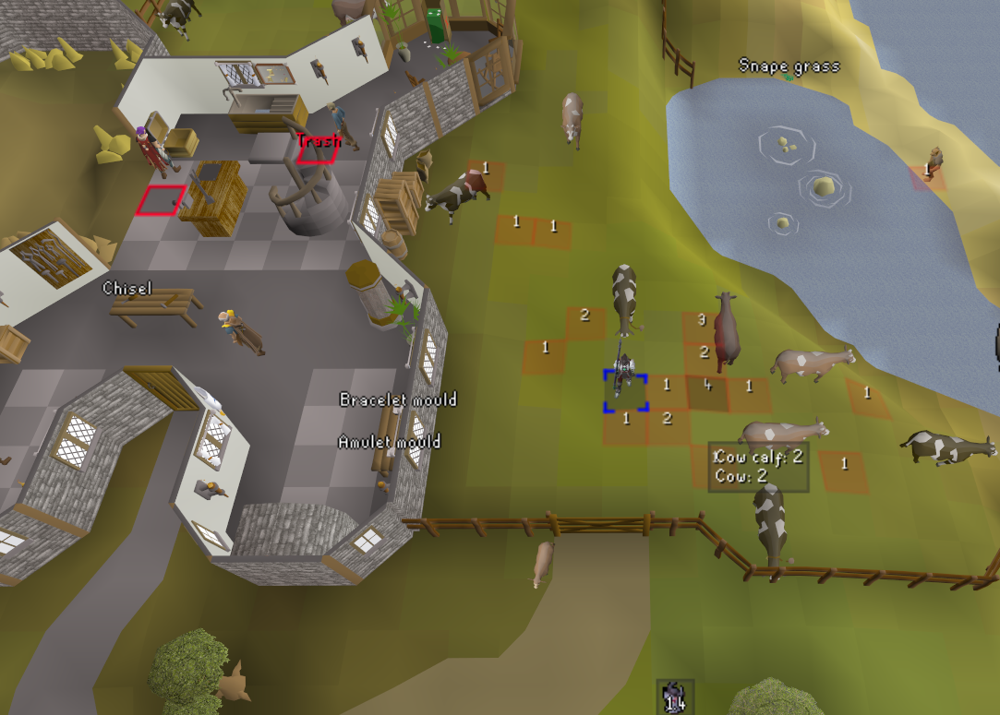

# Crime Scene

A RuneLite plugin that marks the tile where players (and optionally NPCs) die and labels it with
that tile's death count — like evidence markers at a crime scene — plus a leaderboard of who has
died the most.

## Features

- Marks the exact tile a tracked death happens on, with the **in-game skull sprite** and the
  number of deaths recorded on that tile
- Tracks deaths by: **friends list** (default), **friends chat**, **clan members**,
  **other players** (optional, any player), **your own deaths** (default, recorded anywhere),
  and **NPCs** (optional)
- **Hover tooltip** on each tile lists who died there and how many times
- **Leaderboard side panel** (skull icon on the toolbar) with **Players** and **NPCs** tabs,
  ranking everyone by total deaths, plus a **Clear all markers** button
- **Right-click any leaderboard entry** to delete that tracker — removes their deaths from every
  tile and clears any tile left empty
- Markers **persist** across logout (saved to your RuneLite profile)
- Configurable colours and number size, and an optional clear-all hotkey

## Screenshots

## Configuration

| Setting | Default | Description |
| --- | --- | --- |
| Mark friends | on | Mark deaths of players on your friends list |
| Mark friends chat | off | Also mark friends chat members |
| Mark clan members | off | Also mark clan members |
| Mark other players | off | Mark any other player's death, not just friends/chat/clan |
| Mark my own deaths | on | Mark the tile where you die (anywhere) |
| Mark NPCs | off | Also mark the tile where any NPC dies |
| Show skull | on | Draw the skull sprite on the death tile |
| Border colour | red | Tile border colour |
| Fill colour | translucent red | Tile fill colour |
| Font colour | white | Colour of the death number |
| Number size | 14 | Font size of the death number |
| Clear-all hotkey | unset | Removes every marker |

## License

BSD 2-Clause. See [LICENSE](LICENSE).
